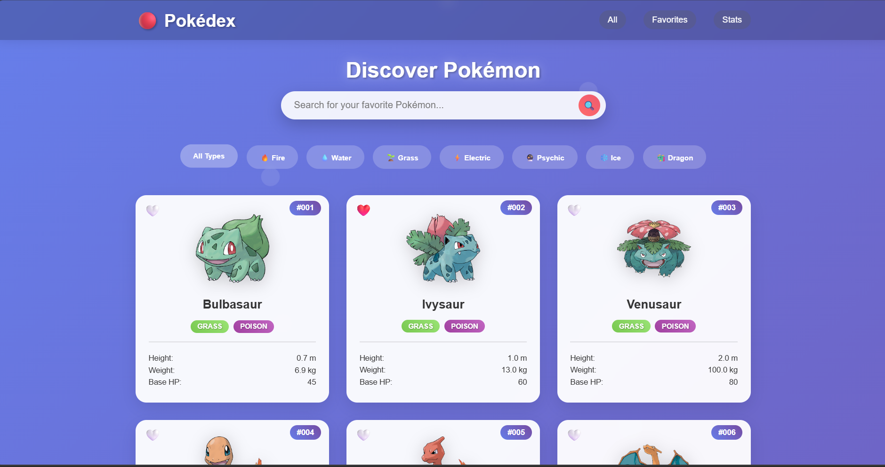

#  Pokédex Web App  Pokédex

A responsive and interactive Pokédex built with modern JavaScript to explore data for over 150 Pokémon using the public PokéAPI.



---

## 🚀 About This Project

This project was created as a personal challenge to practice and showcase my skills in frontend web development, specifically focusing on interacting with third-party APIs. The goal was to build a functional, user-friendly application that fetches, processes, and displays complex data in a clean and visually appealing way.

---

### ✨ Key Features

-   **Dynamic Data Fetching:** Fetches Pokémon data in real-time from the PokéAPI.
-   **Interactive UI:** Each Pokémon has a card displaying its image, stats, type, and more.
-   **Search Functionality:** Allows users to search for their favorite Pokémon by name.
-   **Responsive Design:** Ensures a seamless experience on both desktop and mobile devices.

---

### 🛠️ Tech Stack

-   **Core:** HTML5, CSS3, JavaScript
-   **API:** Native Fetch API for making network requests.
-   **Data Source:** The public [PokéAPI](https://pokeapi.co/).
-   **Development Tools:** VS Code, Git & GitHub.

---

### 🧠 What I Learned

This project was a fantastic learning experience. I significantly improved my understanding of:

-   **JavaScript:** Deepened my knowledge of `async/await` and handling Promises for smooth data fetching without freezing the UI.
-   **API Integration:** Gained practical experience in reading API documentation, making requests, and parsing complex JSON responses.
-   **CSS for Layout:** Used modern CSS techniques like Flexbox/Grid to create a responsive and organized layout.

---

### 📂 How to Run Locally

To get a local copy up and running, follow these simple steps.

1.  Clone the repository:
    ```bash
    git clone [https://github.com/Amandhoke/Pokemon_Pokedex.git](https://github.com/Amandhoke/Pokemon_Pokedex.git)
    ```
2.  Navigate to the project directory:
    ```bash
    cd Pokemon_Pokedex
    ```
3.  Open `index.html` in your favorite browser.

